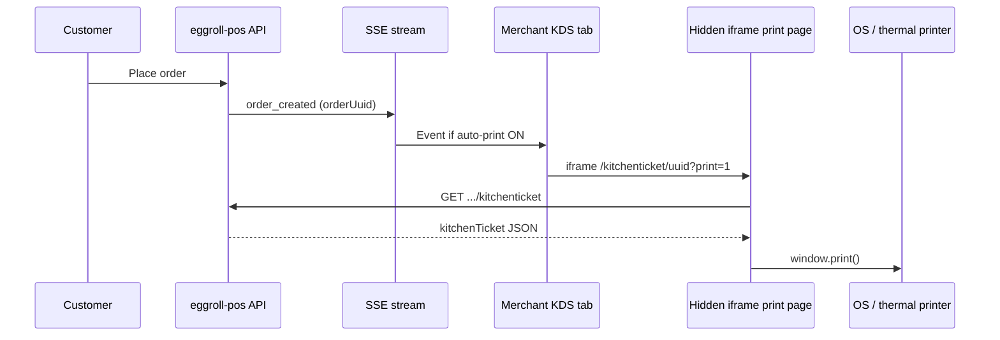

# Kitchen ticket printing

eggroll-pos prints **kitchen tickets** (KOT — kitchen order tickets) through the **browser print dialog**. There is no proprietary printer SDK or network ESC/POS integration yet. Any thermal printer that works with your OS print driver is supported.

## How printing works

### Manual reprint (always available)

1. Open the merchant dashboard: `/md/mc_<hashId>`
2. Tap an order on the KDS board → **order detail**
3. Tap **Print Kitchen Ticket**
4. A new tab opens at `/md/mc_<hashId>/kitchenticket/<orderUuid>?print=1`
5. The browser shows the system **print dialog** → select your thermal printer → confirm
6. An 80mm-formatted ticket prints (order #, items, modifiers, notes — no prices)

Short URL alias: `/md/mc_<hashId>/kt/<orderUuid>?print=1`

### Auto-print on new orders (optional)

Enable in **Settings → Kitchen printing → Auto-print kitchen tickets on new orders**.

When enabled:

1. Keep the **KDS dashboard tab open** and logged in (Supabase session required)
2. A customer places an order (online checkout or API)
3. The server publishes an SSE `order_created` event (includes `orderUuid`)
4. The KDS loads the kitchen ticket print page in a **hidden iframe**
5. The print page fetches ticket JSON and calls `window.print()` automatically
6. The OS print dialog appears — confirm to print (browser may require prior user interaction on some devices)

Manual reprint from order detail still works regardless of this setting.

## API

| Method | Path | Auth | Purpose |
|--------|------|------|---------|
| `GET` | `/api/merchants/:merchantId/orders/:orderUuid/kitchenticket` | Merchant Bearer | Kitchen ticket JSON |
| `PATCH` | `/api/merchants/:merchantId` | Merchant Bearer | Set `kitchenAutoPrint: true/false` |

Merchant row field: `kitchen_auto_print` (boolean, default `false`).

## Recommended thermal printers

These models are widely used in QSR kitchens and work well with **browser → OS driver → USB or network** printing. Install the manufacturer driver and set paper width to **80mm** (or 58mm with adjusted expectations).

### 80mm — recommended

| Model | Connection | Notes |
|-------|------------|-------|
| **Star TSP143IIIU** (or TSP100 series) | USB, Ethernet, Bluetooth | Very common; reliable drivers on Windows/macOS/Linux |
| **Epson TM-T20III** (or TM-T88VI) | USB, Ethernet | Industry standard; enable “cut after print” in driver |
| **Bixolon SRP-350plusIII** | USB, Ethernet | Good budget alternative |
| **Munbyn ITPP047** | USB, Ethernet | Popular low-cost option; use vendor driver |

### 58mm — compact counters

| Model | Connection | Notes |
|-------|------------|-------|
| **Epson TM-m30II** | USB, Bluetooth | Smaller roll; ticket text may wrap more |
| **Star mC-Print3** | USB, Bluetooth, LAN | Mobile / kiosk friendly |

### Setup checklist

1. Install the **official driver** (not generic text-only if avoidable)
2. Set default paper size to **80mm** roll (72–80mm printable width)
3. Enable **auto-cut after print** in driver preferences when available
4. On the kitchen tablet/PC, set this printer as the **default** (or select it each time in the print dialog)
5. In Chrome, allow pop-ups / printing for your eggroll-pos host
6. First print: tap **Print Kitchen Ticket** once manually — some browsers block auto-print until the user has interacted with the site

## Limitations (current)

- **No silent print** — the OS print dialog appears (browser security)
- **No cash-drawer kick** or native ESC/POS cut commands from the app
- **Auto-print requires the KDS tab** to stay open with a valid login
- **Cloud-hosted** deployments (e.g. Railway): printing runs on the **device running the browser**, not the server — the kitchen PC/tablet must have the printer attached or reachable on the LAN
- **Network printers**: supported via OS driver only; no direct TCP :9100 from eggroll-pos yet

## Troubleshooting

| Problem | Fix |
|---------|-----|
| Print dialog never appears | Enable auto-print in Settings; keep KDS tab focused; try manual print first |
| Ticket clipped or tiny | Set driver paper width to 80mm; check `@page` in `KitchenTicketPrint.css` |
| Blank print | Confirm merchant is logged in; check `/api/merchants/.../kitchenticket` returns JSON |
| Double prints | Rare on reconnect; refresh KDS tab if SSE reconnects fire duplicate events |

## Related files

- Ticket model: `src/shared/kitchen_ticket.ts`
- Auto-print logic: `src/shared/kitchen_print.ts`, `src/client/js/lib/kitchenTicketPrint.ts`
- Print page: `src/client/js/pages/KitchenTicketPrint.tsx`
- Settings toggle: `src/client/js/pages/MerchantSettings.tsx`
- Routes: `docs/routes.md`
