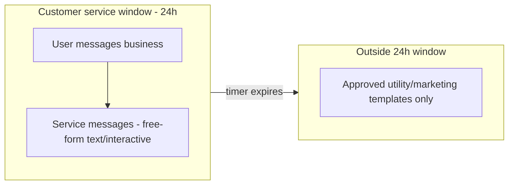
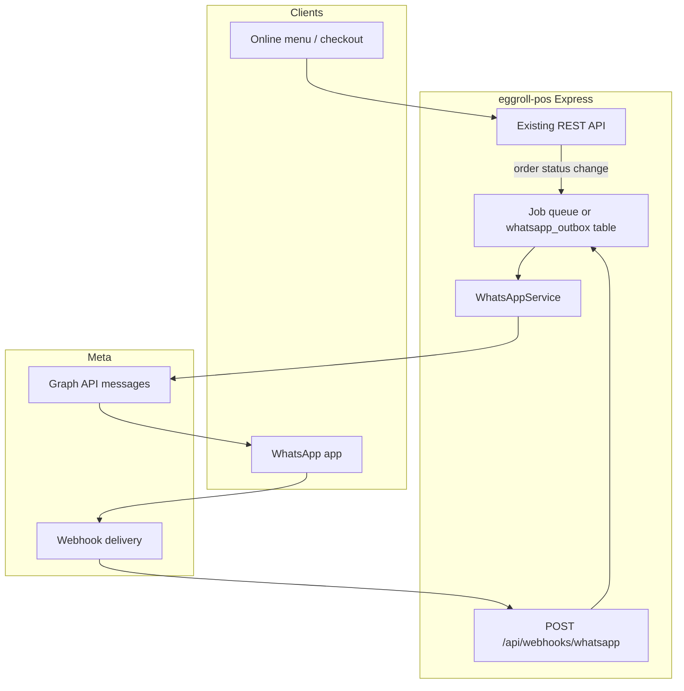
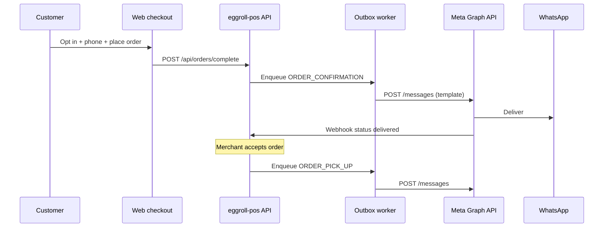

# WhatsApp Integration Plan for eggroll-pos

This document describes how to integrate **eggroll-pos** online ordering with the **WhatsApp Business Platform** (Cloud API). It is based on Meta’s official documentation as of May 2026 and on the current eggroll-pos codebase.

**Official references:**

- [About the WhatsApp Business Platform](https://developers.facebook.com/docs/whatsapp/cloud-api/)
- [Service messages & customer service windows](https://developers.facebook.com/docs/whatsapp/cloud-api/guides/send-messages)
- [Webhooks](https://developers.facebook.com/docs/whatsapp/cloud-api/guides/set-up-webhooks)
- [Template Library (utility / order templates)](https://developers.facebook.com/docs/whatsapp/cloud-api/guides/send-message-templates/utility-templates)
- [Pricing](https://developers.facebook.com/docs/whatsapp/pricing)

---

## 1. Goals

| Goal | Description |
|------|-------------|
| **Order notifications** | Notify customers on WhatsApp when order status changes (accepted, preparing, ready, canceled). |
| **Order intake** | Let customers start or complete orders via WhatsApp without re-keying in the POS. |
| **Merchant discoverability** | Use `wa.me` / QR links on menus and receipts so customers reach the business on WhatsApp. |
| **Self-hosted fit** | Keep secrets and webhook handling on the merchant’s (or host’s) Express server; no mandatory third-party BSP unless desired. |

Non-goals for an initial release:

- Replacing the web menu entirely.
- Multi-tenant SaaS onboarding of thousands of merchants via Embedded Signup (unless eggroll-pos becomes a Meta Solution Partner later).

---

## 2. Current state in eggroll-pos

### 2.1 What already exists

| Area | Status |
|------|--------|
| **Merchant WhatsApp field** | `merchants.whatsapp_number` — editable in Merchant Settings (`PATCH /api/merchants/:merchantId`). Used for display/contact only today. |
| **Customer phone** | `customers.mobile_phone` — seeded and available for linking WhatsApp `wa_id` to orders. |
| **Online menu (public)** | `GET /api/menus/:slug` + React page `/online-ordering/:slug` (`OnlineMenu.tsx`). |
| **Order lifecycle** | Status machine in `src/shared/orders.ts` (pickup + delivery flows). Merchant advances status via `POST /api/merchants/:merchantId/orders`. |
| **Order API (customer)** | `POST /api/orders/lineitems`, `POST /api/orders/complete` — cart + submit while status is `waiting_for_acceptance`. |
| **Receipts** | `GET /r/:receiptId` — JSON receipt suitable for link-in-message. |
| **Marketing copy** | Landing page and locales already mention “WhatsApp Ordering” as a planned feature. |

### 2.2 Gaps relevant to WhatsApp

- No Cloud API credentials, webhooks, or outbound message service.
- Checkout at `/online-ordering/:slug/checkout` is still a placeholder.
- `CustomerRoutes` (`/order-online/:merchantId`) is legacy; primary public path is slug-based `/online-ordering/:slug`.
- No opt-in tracking, template registry, or message delivery log in the database.
- `whatsapp_number` on the merchant is not the same as a **WhatsApp Business phone number ID** (`phone_number_id`) required by the API.

---

## 3. WhatsApp Business Platform primer

### 3.1 Recommended API: Cloud API

Meta hosts messaging infrastructure. eggroll-pos sends HTTP requests to **Graph API**:

```http
POST https://graph.facebook.com/v25.0/{phone_number_id}/messages
Authorization: Bearer {access_token}
Content-Type: application/json
```

Incoming events and delivery status arrive via **webhooks** (HTTPS POST to your server).

Alternatives (not recommended for v1):

- **On-Premises API** — deprecated path; more ops burden.
- **BSP-only** (Twilio, MessageBird, etc.) — adds cost and dependency; still wraps Cloud API.

### 3.2 Core resources

| Resource | Role |
|----------|------|
| **Meta Business Portfolio** | Container for business assets; verification affects limits. |
| **WhatsApp Business Account (WABA)** | Templates, analytics, phone numbers. |
| **Business phone number** | E.164 number customers message; has `phone_number_id` for API calls. |
| **System user + access token** | Long-lived token for server-side sends (store in env, rotate). |
| **Message templates** | Pre-approved messages for **outside** the 24-hour customer service window. |

### 3.3 Two messaging modes (critical for design)



| Mode | When | Examples for restaurants |
|------|------|---------------------------|
| **Service messages** | User messaged or called you in the last 24 hours (window resets on each inbound message) | Order clarification, “Add fries?” reply, typing indicator |
| **Template messages** | No open window; proactive updates | “Order #42 ready for pickup”, payment reminder |

**Implication for eggroll-pos:** Proactive status updates (order ready 2 hours after last chat) **require utility templates** (e.g. `ORDER_PICK_UP`, `ORDER_CONFIRMATION` from the [Template Library](https://developers.facebook.com/docs/whatsapp/cloud-api/guides/send-message-templates/utility-templates)). Pure web checkout without prior WhatsApp contact → always templates for first notification.

### 3.4 Webhooks

- **Verification (GET):** Meta sends `hub.mode`, `hub.verify_token`, `hub.challenge`. Respond with `hub.challenge` if token matches.
- **Events (POST):** JSON body; subscribe to `messages` field minimum.
- **Security:** Verify `X-Hub-Signature-256` with HMAC-SHA256 using the app secret.
- **SLA:** Return **HTTP 200 within ~5 seconds**; process payload asynchronously (queue/job table).
- **Retries:** Non-200 responses retried up to ~7 days; risk of duplicate processing — use idempotency keys (`wamid`).

Example inbound text (abbreviated from Meta docs):

```json
{
  "object": "whatsapp_business_account",
  "entry": [{
    "changes": [{
      "field": "messages",
      "value": {
        "metadata": { "phone_number_id": "106540352242922" },
        "contacts": [{ "wa_id": "16505551234", "profile": { "name": "Sheena Nelson" } }],
        "messages": [{
          "from": "16505551234",
          "id": "wamid....",
          "type": "text",
          "text": { "body": "I'd like to order lunch" }
        }]
      }
    }]
  }]
}
```

### 3.5 Rate limits and quality (operational)

- **Per-user pair limit:** ~1 message / 6 seconds to the same user (~10/min); bursts allowed but throttle afterward (error `131056`).
- **Throughput:** Default up to ~80 messages/second per business number (higher tiers available).
- **Quality rating** (GREEN / YELLOW / RED) affects messaging limits; avoid spammy marketing.
- **Opt-in required** for template messages — business name and intent must be clear ([Messaging Policy](https://www.whatsapp.com/legal/business-policy)).

### 3.6 Pricing (high level)

Billing is per delivered message by **category** (utility, authentication, marketing, service). Utility templates for order updates are typically cheaper than marketing blasts. See [Pricing](https://developers.facebook.com/docs/whatsapp/pricing) for country tables. Budget for:

- Utility templates per order status (1–3 messages per order).
- Occasional marketing (promos) if merchants opt in.

---

## 4. Integration strategies (choose per phase)

### Strategy A — Notifications + deep links (recommended Phase 1)

**Effort:** Low–medium | **Value:** High

- Web checkout collects **WhatsApp opt-in** + E.164 phone.
- On merchant status change, send **utility template** (order confirmed / ready for pickup / canceled).
- Templates include URL button → `https://{host}/receipts/{id}` or `/online-ordering/{slug}`.
- Merchant settings: link `whatsapp_number` to `https://wa.me/{digits}?text={encoded_menu_link}` on printed menu / online menu header.

No inbound bot required for v1.

### Strategy B — “Order on WhatsApp” via structured chat (Phase 2)

**Effort:** Medium–high

- Webhook handler parses text + **interactive** replies (list/buttons).
- State machine maps intents → `addOrderLineItem` / `complete` APIs.
- Optional: [WhatsApp Flows](https://developers.facebook.com/docs/whatsapp/flows/) for address / pickup time (forms).

### Strategy C — Catalog / commerce messages (Phase 3)

**Effort:** High

- Sync `menu_items` to Meta **product catalog**; send product list / multi-product messages.
- Best for markets where in-chat catalog UX is standard; more Meta review and catalog sync work.

### Strategy D — Click-to-WhatsApp only (minimal)

**Effort:** Very low

- No API; customers manually send order text to merchant’s WhatsApp.
- Merchant copies into POS manually.

Use only as interim; Strategy A should ship quickly after.

---

## 5. Recommended target architecture



### 5.1 New server modules (proposed)

```
src/server/
  routes/whatsapp_webhook.js    # GET verify + POST ingest
  services/whatsapp/
    client.js                   # Graph API send, signature verify
    templates.js                # Map order status → template name + components
    inbound.js                  # Parse webhook → actions (Phase 2)
  models/whatsapp_messages.js   # Audit + idempotency
```

Mount in `src/server/index.js`:

```javascript
app.use('/api/webhooks/whatsapp', whatsappWebhookRouter);
```

**Do not** mount webhook under the React catch-all `/*` route.

### 5.2 Environment variables

| Variable | Purpose |
|----------|---------|
| `WHATSAPP_ACCESS_TOKEN` | System user token (Business Management + messaging perms) |
| `WHATSAPP_APP_SECRET` | Webhook signature verification |
| `WHATSAPP_VERIFY_TOKEN` | Arbitrary string for GET challenge |
| `WHATSAPP_PHONE_NUMBER_ID` | Sender ID for API (per merchant later if multi-WABA) |
| `WHATSAPP_WABA_ID` | Template management |
| `WHATSAPP_API_VERSION` | e.g. `v25.0` |
| `PUBLIC_BASE_URL` | Absolute links in templates (`https://pos.example.com`) |

For **multi-merchant self-hosted** deployments, store per-merchant credentials encrypted in DB (see §6.2). For **single-merchant** installs, env vars are enough.

### 5.3 Hook points in existing code

| Event | Hook location | WhatsApp action |
|-------|---------------|-----------------|
| Order submitted (`POST /api/orders/complete`) | After `verifyOrderLineItemsCompleted` | Template: order received + receipt link |
| Status → `accepted` / `preparing` | `Orders.update` in merchants route or model | Optional utility update (if window closed) |
| Status → `ready_for_pickup` / `ready_for_delivery` | Same | Template: `ORDER_PICK_UP` or delivery update |
| Status → `canceled` / `refunded` | Same | Template: `ORDER_OR_TRANSACTION_CANCEL` |
| Inbound text | Webhook → `inbound.js` | Open service window; bot or handoff |

Use **async enqueue** from HTTP handlers so API latency stays unchanged.

---

## 6. Data model changes

### 6.1 Phase 1 tables

**`whatsapp_opt_ins`**

| Column | Type | Notes |
|--------|------|-------|
| `id` | PK | |
| `customer_id` | FK → customers | |
| `merchant_id` | FK → merchants | |
| `wa_id` | string | From webhook `contacts[].wa_id` |
| `phone_e164` | string | Normalized |
| `opted_in_at` | timestamp | |
| `opt_in_source` | enum | `web_checkout`, `whatsapp_inbound`, `qr` |
| `marketing_allowed` | boolean | Default false |

**`whatsapp_message_log`**

| Column | Type | Notes |
|--------|------|-------|
| `id` | PK | |
| `merchant_id` | FK | |
| `order_id` | FK nullable | |
| `wa_message_id` | string unique | Meta `wamid` — idempotency |
| `direction` | enum | `inbound` / `outbound` |
| `template_name` | string nullable | |
| `status` | string | `sent`, `delivered`, `read`, `failed` |
| `payload_json` | jsonb | Redact PII in logs if needed |
| `created_at` | timestamp | |

**`whatsapp_outbox`** (optional but recommended)

Queue rows: `pending` → worker sends → updates log from status webhooks.

### 6.2 Phase 2+ — per-merchant Cloud API (multi-tenant)

**`merchant_whatsapp_accounts`**

| Column | Type | Notes |
|--------|------|-------|
| `merchant_id` | FK unique | |
| `waba_id` | string | |
| `phone_number_id` | string | |
| `display_phone_number` | string | |
| `access_token_encrypted` | text | KMS or app-level encryption |
| `token_expires_at` | timestamp nullable | |
| `webhook_override_path` | string nullable | Per WABA override URL |

### 6.3 Customer linkage

- On checkout: require or strongly encourage phone; normalize to E.164 (`libphonenumber-js` or similar).
- On first inbound webhook: match `wa_id` / `from` to `customers.mobile_phone` or create customer row.
- Store `customers.whatsapp_wa_id` if phone and `wa_id` diverge (common internationally).

### 6.4 Merchant settings UI extensions

Extend `MerchantSettings.tsx`:

- **Display number** (existing `whatsapp_number`) — customer-facing `wa.me` link.
- **Cloud API connected** (read-only status): phone_number_id, quality rating (from Graph API).
- **Notification toggles**: which statuses trigger WhatsApp.
- **Template language** per merchant (maps to `en_US`, `ms_MY`, `zh_CN`, matching i18n).

---

## 7. Message design

### 7.1 Templates to create (utility / order)

Use Template Library filters: `topic=ORDER_MANAGEMENT`, `usecase` in:

- `ORDER_CONFIRMATION`
- `ORDER_PICK_UP`
- `DELIVERY_UPDATE`
- `ORDER_OR_TRANSACTION_CANCEL`

Create via API:

```http
POST /{waba_id}/message_templates
```

with `library_template_name` and button URL pointing to `{{1}}` = order or receipt path on `PUBLIC_BASE_URL`.

**Per-locale:** Create one template per language merchants need (`en_US`, `zh_CN`, `ms_MY`) — aligns with existing `src/client/locales/*.yaml`.

### 7.2 Example: order ready (template, outside 24h window)

```json
{
  "messaging_product": "whatsapp",
  "to": "+15551234567",
  "type": "template",
  "template": {
    "name": "order_pick_up_eggroll",
    "language": { "code": "en_US" },
    "components": [
      {
        "type": "body",
        "parameters": [
          { "type": "text", "text": "INSTEP Cafe" },
          { "type": "text", "text": "#12" },
          { "type": "text", "text": "15 min" }
        ]
      },
      {
        "type": "button",
        "sub_type": "url",
        "index": "0",
        "parameters": [
          { "type": "text", "text": "receipts/abc-uuid" }
        ]
      }
    ]
  }
}
```

### 7.3 Service messages (inside 24h window)

After customer messages “menu” or taps a `wa.me` link with prefill text:

- **Interactive list** — categories from `GET /api/menus/:slug`.
- **Interactive reply buttons** — “View cart”, “Submit order”, “Talk to staff”.
- **CTA URL button** — “Open full menu” → `/online-ordering/{slug}`.

Send API shape:

```json
{
  "type": "interactive",
  "interactive": {
    "type": "list",
    "body": { "text": "What would you like?" },
    "action": {
      "button": "Browse menu",
      "sections": [{ "title": "Mains", "rows": [{ "id": "item_12", "title": "Latte", "description": "$4.50" }] }]
    }
  }
}
```

Map `interactive.list_reply.id` → `menuItemId` in `addOrderLineItem`.

### 7.4 Status mapping (eggroll-pos → template)

| `OrderStatus` | Template / message type |
|---------------|---------------------------|
| `waiting_for_acceptance` | After complete: `ORDER_CONFIRMATION` |
| `accepted` | Optional service text or utility |
| `preparing` | Usually skip (noise) |
| `ready_for_pickup` | `ORDER_PICK_UP` |
| `ready_for_delivery` | `DELIVERY_UPDATE` |
| `delivery_in_progress` | `DELIVERY_UPDATE` |
| `pickup_success` / `delivered` | Short thank-you (service) or receipt link |
| `canceled` / `refunded` | `ORDER_OR_TRANSACTION_CANCEL` + reason param |

---

## 8. End-to-end flows

### 8.1 Flow: Web order + WhatsApp notifications (Phase 1)



**Checkout changes:**

1. Phone field (required for WhatsApp notifications).
2. Checkbox: “Send order updates on WhatsApp” + link to privacy note.
3. Persist opt-in before calling `complete`.

### 8.2 Flow: Customer initiates via `wa.me` (Phase 1 partial)

1. Online menu shows button: `https://wa.me/15551234567?text=Order%20from%20{slug}`.
2. Customer sends message → **24h window opens**.
3. Webhook receives inbound → auto-reply service message with link to `/online-ordering/{slug}` (or start Strategy B bot).

### 8.3 Flow: Conversational order (Phase 2)

1. Inbound “order” / button → create order via `Orders.create` + session token keyed by `wa_id`.
2. List replies add line items.
3. “Checkout” → `verifyOrderLineItemsCompleted` + payment instructions (cash/card on pickup).
4. Merchant dashboard unchanged — same order UUID appears in grid.

**Session store:** `whatsapp_sessions` table (`wa_id`, `order_uuid`, `expires_at`) or Redis if available.

---

## 9. Meta setup checklist (operators)

1. Create [Meta Developer](https://developers.facebook.com/) app → add **WhatsApp** product.
2. Create / link **Business Portfolio** and **WABA** (test WABA provided for dev).
3. Add business phone number → obtain `phone_number_id`.
4. Create **system user** in Business Settings → generate token with:
   - `whatsapp_business_messaging`
   - `whatsapp_business_management`
5. Configure webhook URL: `https://{PUBLIC_BASE_URL}/api/webhooks/whatsapp`.
6. Subscribe to `messages` (and `message_template_status_update` for template debugging).
7. Create utility templates from Template Library; wait for `APPROVED` (library templates often instant).
8. Add payment method on WABA before production scale.
9. Switch app to **Live** mode when going to production (dev mode limits webhooks).
10. For local dev: tunnel (ngrok, Cloudflare Tunnel) with HTTPS.

---

## 10. Security, privacy, and compliance

| Topic | Approach |
|-------|----------|
| **Webhook authenticity** | Verify `X-Hub-Signature-256` on every POST. |
| **Token storage** | Env vars for single-tenant; encrypted DB for multi-tenant. |
| **PII** | Minimize `payload_json` retention; document in privacy policy. |
| **Opt-in** | Record timestamp + source; no marketing templates without explicit flag. |
| **User deletion** | Honor block/report; stop sending when webhook indicates opt-out / user preferences (field `user_preferences` if subscribed). |
| **HTTPS** | Mandatory for webhooks; align with production TLS termination. |

---

## 11. Implementation phases

### Phase 0 — Documentation & ops (this document)

- Align product on Strategy A first.
- Register Meta app + test WABA.

### Phase 1 — Outbound notifications (MVP)

| Task | Details |
|------|---------|
| DB migrations | `whatsapp_opt_ins`, `whatsapp_message_log`, `whatsapp_outbox` |
| `WhatsAppService` | `sendTemplate`, `verifySignature`, `normalizePhone` |
| Webhook route | GET verify + POST enqueue |
| Worker | Cron or in-process worker draining outbox (single-node self-host OK) |
| Templates | `ORDER_CONFIRMATION`, `ORDER_PICK_UP`, cancel template × languages |
| Checkout | Phone + opt-in on `/online-ordering/:slug/checkout` |
| Merchant UI | Toggle notifications; show `wa.me` link preview |
| Hooks | After `orders/complete` + merchant status POST |

**Acceptance criteria:**

- Customer completes web order with opt-in → receives WhatsApp template with receipt link.
- Merchant marks ready → customer receives pickup template.
- Duplicate webhooks do not double-send (unique `wa_message_id`).

### Phase 2 — Inbound assistant

| Task | Details |
|------|---------|
| Parse inbound text + interactive | Map to menu/order APIs |
| Session management | `wa_id` ↔ `order_uuid` |
| Auto-replies | Menu link, hours from `menus.business_hours` |
| Merchant handoff | Service message: “Staff will reply shortly” |

### Phase 3 — Catalog & advanced

| Task | Details |
|------|---------|
| Meta catalog sync | From `menu_items` |
| Product list messages | In-chat ordering |
| Embedded Signup | Only if offering hosted multi-merchant SaaS |
| Payments | Brazil/India Payments API if applicable |

---

## 12. Testing plan

| Layer | Method |
|-------|--------|
| **Unit** | Template parameter builder; phone normalization; signature verification fixture |
| **Integration** | Meta test WABA + [API Playground](https://developers.facebook.com/docs/whatsapp/cloud-api/) |
| **Webhook** | App Dashboard “Send test payload”; ngrok tunnel to local Express |
| **E2E** | Seed merchant `a0000001-...`, place order on `instep-cafe-new-york-10001-lunch-menu`, advance status, assert log row + delivery webhook |
| **Failure** | Invalid token, blocked user, rate limit `131056` — ensure outbox retry/backoff |

---

## 13. Deployment notes (eggroll-pos specific)

- Run Express with **tsx** (see `AGENTS.md`); webhook route is plain JS like other routes.
- Set `PUBLIC_BASE_URL` to the same origin customers use (Vite dev: `http://localhost:3001` only works with tunnel for webhooks).
- **SQLite vs PostgreSQL:** `jsonb` columns work on both if using JSON type in Knex migration (SQLite JSON).
- Do not commit access tokens; document vars in `README.md` / `.env.example`.

---

## 14. Cost and capacity rough estimate

For a merchant doing **50 orders/day**, ~2–3 utility messages per order → **100–150 billable utility messages/day**. Use Meta’s country rate card for exact USD. Service messages inside an active chat window are billed under SERVICE category (often relevant when replying to “where is my order?”).

Monitor **quality rating** in WhatsApp Manager; avoid sending marketing templates to users who only opted in to order updates.

---

## 15. Alternatives and future options

| Option | When to consider |
|--------|------------------|
| **BSP (Twilio, 360dialog)** | Need managed SLAs, less webhook ops |
| **WhatsApp Business App coexistence** | Merchant wants app + API same number ([coexistence docs](https://developers.facebook.com/docs/whatsapp/embedded-signup/onboarding-business-app-users/)) |
| **MM API for marketing** | Promotional broadcasts with optimization |
| **Solution Partner / Embedded Signup** | eggroll-pos Cloud SaaS onboarding many WABAs |

---

## 16. Open decisions (product)

1. **Single WABA per deployment vs per merchant** — self-hosted installs likely one WABA; SaaS needs Embedded Signup.
2. **Mandatory phone on checkout** — required for WhatsApp path, optional for web-only.
3. **Languages** — match merchant `i18n` / menu locale for template `language.code`.
4. **Payment in chat** — out of scope until checkout and payment gateways are complete on web.

---

## 17. Summary

eggroll-pos already has the **order pipeline**, **public menus**, **customer phone numbers**, and a **merchant WhatsApp display field**. The fastest high-value path is **Phase 1**: utility templates + webhooks + outbox hooked to existing order status transitions, with checkout opt-in and `wa.me` links on the online menu. **Phase 2** adds inbound interactive ordering tied to `/api/orders` endpoints. All of this should use the official **WhatsApp Cloud API**, Graph API sends, and signed webhooks per Meta’s documentation.

Next implementation step: add `.env.example` keys, migrations in §6.1, and `POST /api/webhooks/whatsapp` skeleton behind a feature flag `WHATSAPP_ENABLED`.
